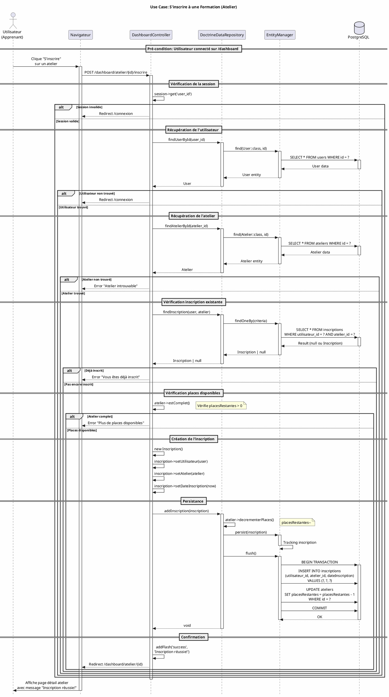
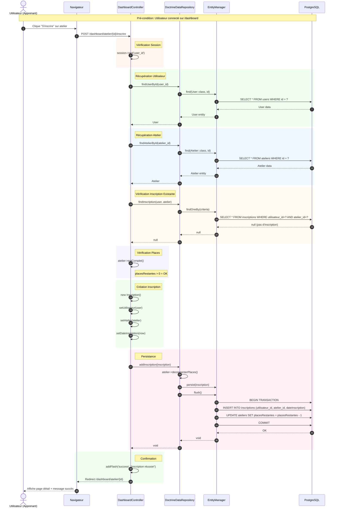

# Diagramme de Séquence - Use Case "S'inscrire à la Formation"

## Acteurs et Composants
- **Utilisateur** : Apprenant connecté
- **Navigateur** : Interface web
- **DashboardController** : Contrôleur Symfony
- **DoctrineDataRepository** : Service d'accès aux données
- **EntityManager** : Gestionnaire Doctrine ORM
- **Base de données** : PostgreSQL

---

## Diagramme PlantUML

---

## Diagramme Mermaid (Alternative)

---

## Description Textuelle du Flux

### Scénario Principal (Succès)

| Étape | Acteur | Action |
|-------|--------|--------|
| 1 | Utilisateur | Clique sur "S'inscrire" pour un atelier depuis /dashboard |
| 2 | Navigateur | Envoie POST /dashboard/atelier/{id}/inscrire |
| 3 | Controller | Vérifie session utilisateur (user_id) |
| 4 | Controller | Récupère User via Repository |
| 5 | Controller | Récupère Atelier via Repository |
| 6 | Controller | Vérifie absence d'inscription existante |
| 7 | Controller | Vérifie places disponibles (estComplet() = false) |
| 8 | Controller | Crée nouvelle Inscription avec date courante |
| 9 | Repository | Décrémente placesRestantes de l'atelier |
| 10 | EntityManager | Persiste et flush en transaction |
| 11 | Controller | Ajoute flash message "Inscription réussie!" |
| 12 | Controller | Redirige vers /dashboard/atelier/{id} |
| 13 | Navigateur | Affiche page détail avec confirmation |

### Scénarios Alternatifs (Erreurs)

| Code | Condition | Résultat |
|------|-----------|----------|
| ALT-1 | Session invalide | Redirect vers /connexion |
| ALT-2 | Utilisateur non trouvé | Redirect vers /connexion |
| ALT-3 | Atelier non trouvé | Flash error "Atelier introuvable" |
| ALT-4 | Déjà inscrit | Flash error "Vous êtes déjà inscrit" |
| ALT-5 | Atelier complet | Flash error "Plus de places disponibles" |

---

## Fichiers Sources Impliqués

| Composant | Fichier |
|-----------|---------|
| Controller | `src/Controller/DashboardController.php` (méthode `inscrire()`) |
| Repository | `src/Service/DoctrineDataRepository.php` |
| Entity User | `src/Entity/User.php` |
| Entity Atelier | `src/Entity/Atelier.php` |
| Entity Inscription | `src/Entity/Inscription.php` |
| Template | `templates/dashboard/index.html.twig` |
| Template Détail | `templates/dashboard/atelier_detail.html.twig` |
